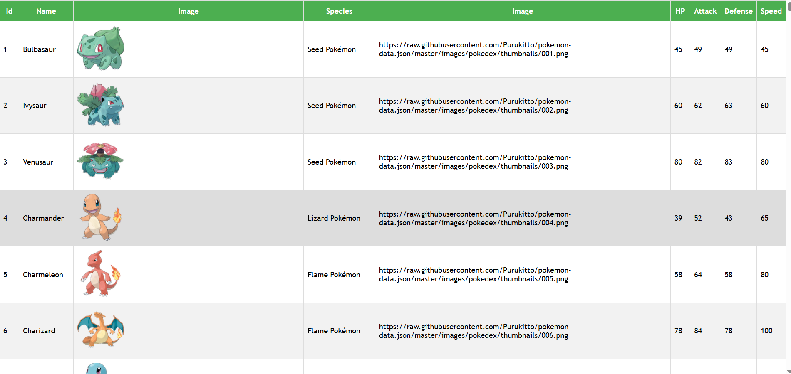
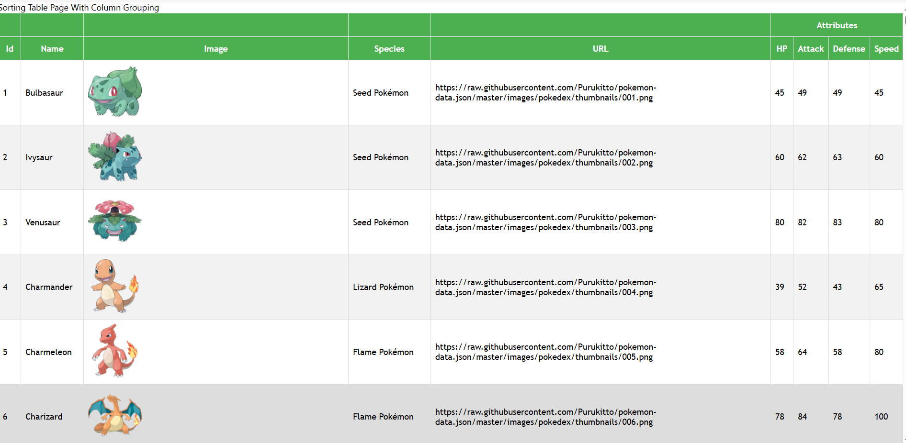
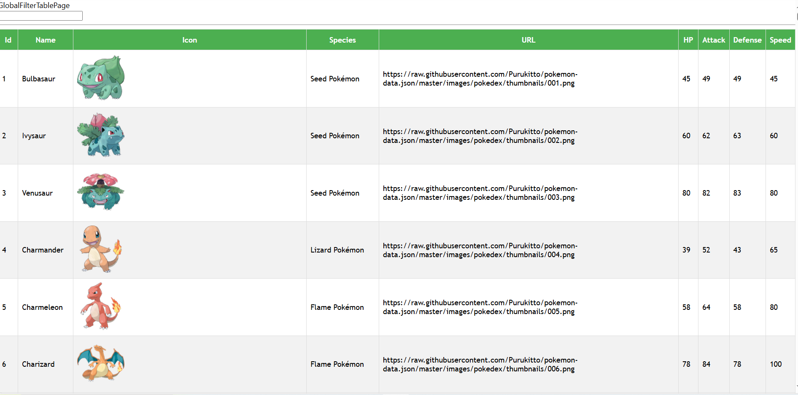
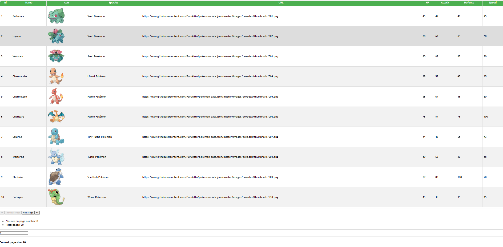

## **Tanstack React Table JS**

**Version:** 1.1
**Date:** May 10, 2025

---

## Description

This is a frontend Application template to build tables with ReactJS.

## Authors

- [@jadogeri](https://www.github.com/jadogeri)

## Acknowledgements

- Design and template by [dmitrisanzharov](https://github.com/dmitrisanzharov)

## Project Template

-[source code](https://github.com/dmitrisanzharov/tanstack-yt-react-table-v8)

## Deployment

Application is deployed using Github Pages

 [https://jadogeri.github.io/Tanstack_React_Table_JS/ ](https://jadogeri.github.io/Tanstack_React_Table_JS/)

## Repository

[https://github.com/jadogeri/Tanstack_React_Table_JS.git](https://github.com/jadogeri/Tanstack_React_Table_JS.git)

## Screenshots

| BASIC  TABLE                                       | SORTING TABLE                                 |
| -------------------------------------------------- | --------------------------------------------- |
|         |  |
| GLOBAL FILTER TABLE                                | COLUMN FILTER TABLE                           |
|  |    |
| PAGINATION TABLE                                   | PAGINATION TABLE                              |
|    |    |

## Table of Contents

<ul>
      <li><a href="#1-introduction">1. Introduction</a>
        <ul>
          <li><a href="#11-purpose">1.1 Purpose</a> </li>
        </ul>
      </li>
    </ul>
     <ul>
      <li><a href="#5-installation">2. Installation</a>
      </li>
    </ul> 
    <ul>
        <li><a href="#6-usage">3. Usage</a>
        <ul>
            <li><a href="#61-run-application">3.1 Run Application</a> </li>
            <ul>
              <li><a href="#611-run-locally">3.1.1 Run Locally</a> </li>
            </ul>
        </ul>
        </li>
    </ul> 
    <ul> 
        <li><a href="#10-references">4. References</a>
        </li>
    <ul>
</ul>

## **1. Introduction**

### **1.1 Purpose**

This document outlines the components, and design considerations for utilizing tanstack react table templates in a reactjs application.

## **2. Installation**

* [Download and install NodeJS](https://nodejs.org/en/download)

---

## **3. Usage**

**Prerequisites** :installation of NodeJS.

### **3.1 Run Application**

1 Open command prompt or terminal.

2 Type command git clone https://github.com/jadogeri/Tanstack_React_Table_JS.git then press enter.

```bash
  git clone https://github.com/jadogeri/Tanstack_React_Table_JS.git
```

3 Enter command cd Tanstack_React_Table_JS then press enter.

```bash
  cd Tanstack_React_Table_JS
```

#### **3.1.1 Run Locally**

1 Type npm install to install dependencies.

```bash
  npm install
```

2 Type npm start to run application

```bash
  npm start
```

---

## **4. References**

* FreeCodeCamp : [Frontend Web Development: (HTML, CSS, JavaScript, TypeScript, React)](https://www.youtube.com/watch?v=MsnQ5uepIa).
* AweSome Open Source : [Awesome Readme Templates](https://awesomeopensource.com/project/elangosundar/awesome-README-templates)
* Readme.so : [The easiest way to create a README](https://readme.so/)
* HUXN Webdev : [Master ReactJS in 7 Hours with 10 Real-World Projects 2023](https://www.youtube.com/watch?v=XrwsMN2IWnE/)
* Dave Gray : [React JS Full Course for Beginners | Complete All-in-One Tutorial | 9 Hours](https://www.youtube.com/watch?v=RVFAyFWO4go/)
* Dipesh Malvia : [Learn React JS with Project in 2 Hours | React Tutorial for Beginners | React Project Crash Course](https://www.youtube.com/watch?v=0riHps91AzE/)
* Github Pages : [Learn to deploy React App & Render using Github Pages Tutorial](https://github.com/gitname/react-gh-pages)
* CoderDimitri : [Learn Tanstack React Table Tutorial ](https://www.youtube.com/watch?v=fL8VlLe8Upo)


